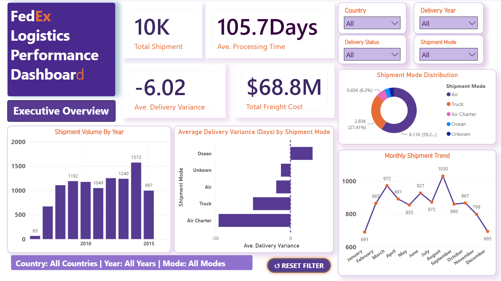
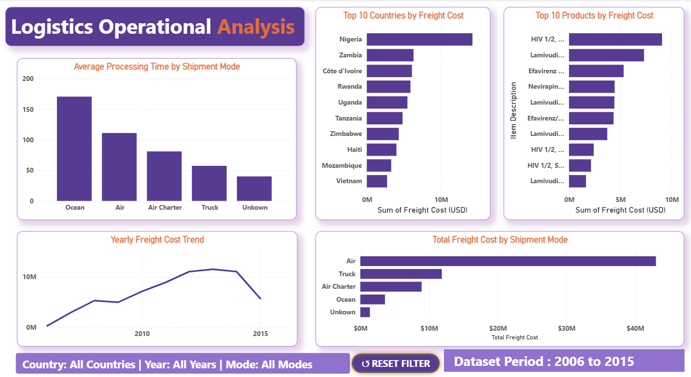

# FedEx Logistics & Supply Chain Analysis

An exploratory data analysis (EDA) project that examines FedEx SCMS delivery-history data to understand shipment performance, delivery efficiency, freight costs, vendor performance, and logistics operations across countries.

## Project objectives

- Explore shipment modes, destination countries, vendors, manufacturing sites, and product brands.
- Analyze freight cost, shipment value, delivery delay, and processing-time patterns.
- Identify operational bottlenecks and opportunities to improve delivery performance and control logistics costs.
- Present business-focused insights through clear visualizations.

## Repository contents

```text
.
├── fedex_logistics_supply_chain_analysis.ipynb  # Main analysis notebook
├── data/                                        # Raw and cleaned project datasets
├── images/                                      # Power BI dashboard screenshots
├── README.md                                    # Project documentation
├── requirements.txt                             # Python dependencies
└── .gitignore                                   # Files Git should exclude
```

## Datasets

The repository includes both versions of the SCMS Delivery History dataset:

- `data/scms_delivery_history_raw.csv` — original raw dataset.
- `data/fedex_cleaned.csv` — cleaned dataset created for analysis.

The analysis notebook loads the raw dataset. Its data-loading cell is set to:

```python
pd.read_csv("data/scms_delivery_history_raw.csv")
```

## Setup and run

```bash
git clone <your-repository-url>
cd fedex-logistics-supply-chain-analysis
python -m venv .venv
```

Activate the environment:

```powershell
.\.venv\Scripts\Activate.ps1
```

Install dependencies and start Jupyter:

```bash
pip install -r requirements.txt
jupyter notebook
```

Then open `fedex_logistics_supply_chain_analysis.ipynb` and run its cells in order.

## Tools used

Python, Jupyter Notebook, Pandas, NumPy, Matplotlib, Seaborn, and Plotly.

## Key insights

- The dataset covers **approximately 10,000 shipments** and **$68.8 million** in total freight cost.
- **Air** is the dominant shipment mode, with about **6.11K shipments (59.2%)**; truck is second with about **2.83K shipments (27.4%)**.
- The average delivery variance is **-6.02 days**, indicating that deliveries were, on average, ahead of the scheduled date.
- **Ocean** shipments have the longest average processing time (about **170 days**), while truck shipments are processed much faster (about **56 days**).
- Shipment volume reaches its highest point in **2014 (1,573 shipments)**. Across months, **August** has the highest activity (**1,030 shipments**).
- **Nigeria** has the highest freight cost among destination countries, making it an important area for cost-optimization efforts.

## Power BI dashboard

Explore the interactive dashboard: [FedEx Logistics & Supply Chain Dashboard](https://app.powerbi.com/Redirect?action=openreport&context=Annotate&ctid=850aa78d-94e1-4bc6-9cf3-8c11b530701c&pbi_source=mobile_android&groupObjectId=8f44476f-93f9-42ef-9b9b-9533257dee48&reportObjectId=35bf2b6e-6298-47f8-91e3-65544d30fee2&reportPage=10ad3d40769f7e303c91&bookmarkGuid=595d3c91-d9ac-41d8-a831-4753cb9c4eca&fullScreen=0)

### Executive overview



### Operational analysis



## Author

Sakshi Chore
